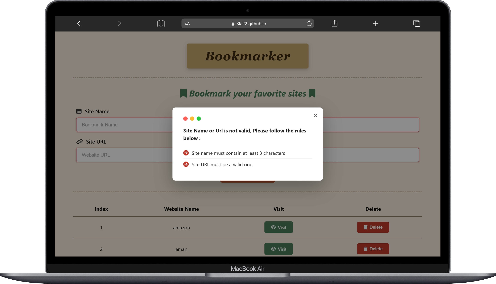
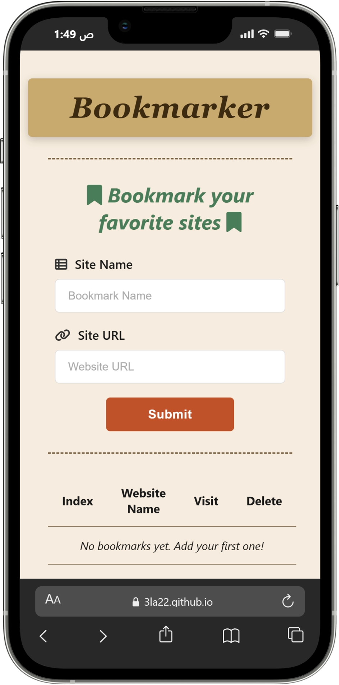
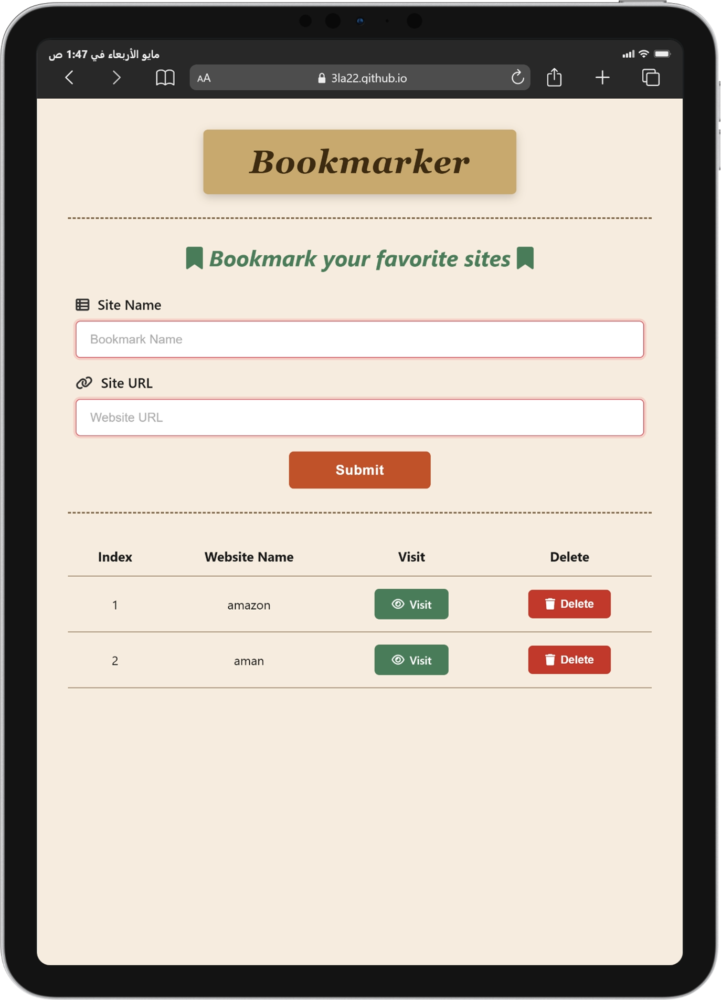

# Bookmarker 🔖

A simple bookmark manager built with HTML, CSS, and JavaScript. Save your favorite websites and visit them anytime with one click.

## 🔗 Live Demo

https://3la22.github.io/Bookmarker/

## 📸 Screenshots

## 🛠️ Built With

- HTML
- CSS
- JavaScript

## ✨ Features

- Add bookmarks with a name and URL
- Validates that the site name has at least 3 characters
- Validates that the URL is a real valid URL
- Visit any saved site with one click
- Delete bookmarks you no longer need
- Data is saved in localStorage — stays after refresh

